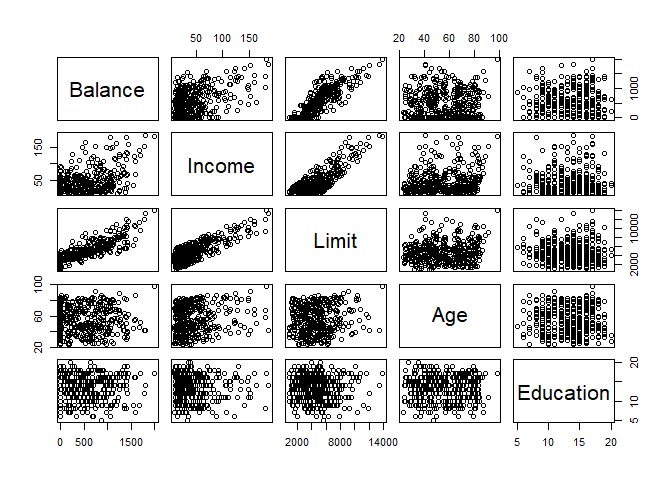
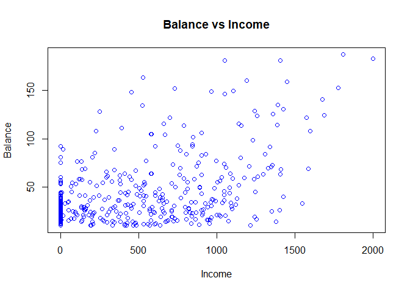
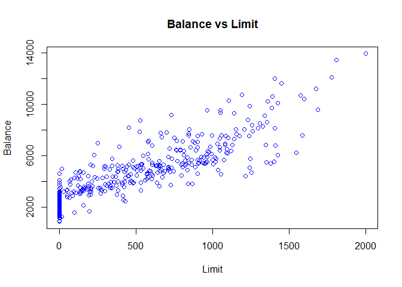
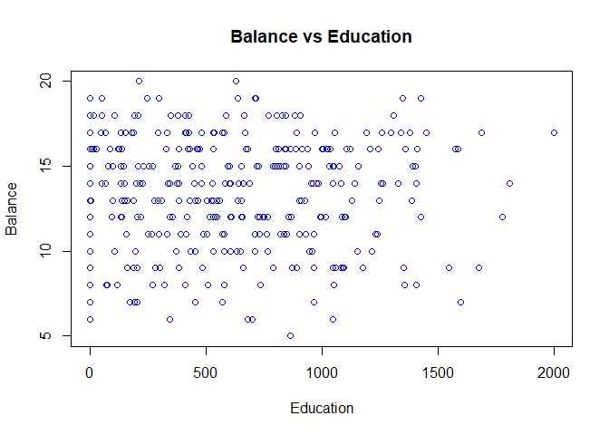
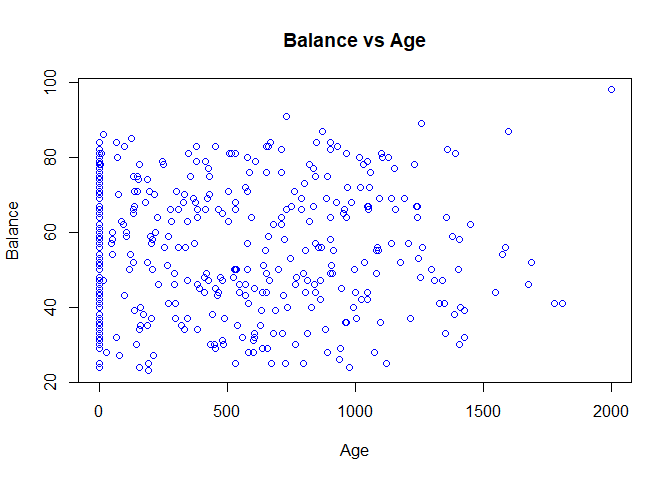

Credit Card Balance; Who is More in Debts
================
Nima Niarad
7/22/2021

<style> body {text-align: justify} </style>

<!-- Justify text. -->

## Part A

### Executive Summary

A simulated data set of information from ten thousand customers

The aim here is to predict which customers are less in debt on their
credit cards and can be trusted to increase their limits. In this
project, I show you what exact type of persons we should have more in a
bank to reduce credit card balances.

### Purpose

According to [2019 NerdWallet
statistics](https://www.nerdwallet.com/blog/average-credit-card-debt-household/#foot),
credit card balances are rising by $435.9 billion halfway through 2019.

The average is around 6800 dollars in revolving balances. On the other
hand, the interest rates are also increased and made a reverse impact on
people to pay off. One out of 11 Americans will never be completely free
of the debt, according to a NerdWallet survey conducted by The Harris
Poll. It means a lot of people are in debt to banks all the time!

Who is going to pay for this are banks! Customers just are carrying
debts from month to month.

In this project, customers with the highest amount of debt are analyzed.
and what banks can do to reduce debts.Solutions to reduce these debts
are also provided for banks.

There are couple of questions need to be answered, such as which
individuals can manage their budgets and pay off their debts better.

The first thing that comes to mind can be rich people, but what about
the most majority of middle class communities. Banks would not like to
lose their customers to their competitors. So, what is important is to
know how banks can have more customers with less debt.

Four kinds of individuals are investigated: Students(Non-Students),
Married (Unmarried ones), Males (Females), and the individuals ethnicity
based on these factors: Income, Credit limit, Age, Education, and
Balance.

### Model

In this chapter, the main model will be studied and its advantages and
disadvantages are discussed.

**Linear Regression Model**

Linear regression is a model that can simply explain how individuals
balances are affected by other items such as incomes and limit or they
type of persons, students, married or not.

**May have to apply for some high orders non-linear equations to get
better predictions.**

During the analysis, it will be decided which specific models are most
useful to apply.

**Why Linear?**

First starting with simple methods such as linear regression model. Why?
Getting the results sooner and in the easiest way. Beginning with linear
regression has also another major benefit. It can help to reduce the
cost of the project for the company as spending less time.

What is more, the regression model is a good approach to find out the
relationship between the Balances and other factors. Based on the
results, it can be said that which groups of individuals playing a key
role in defaulting and suggesting efficient solutions.

``` r
library(readr)
Credit <- read_csv("C:/Nima/Rstudio/Git/Credit Card Balance; Who is More in Debts/Credit-Card-Balance--Who-is-More-in-Debts-/Credit.csv")
```

    ## 
    ## -- Column specification --------------------------------------------------------
    ## cols(
    ##   X1 = col_double(),
    ##   ID = col_double(),
    ##   Income = col_double(),
    ##   Limit = col_double(),
    ##   Rating = col_double(),
    ##   Cards = col_double(),
    ##   Age = col_double(),
    ##   Education = col_double(),
    ##   Gender = col_character(),
    ##   Student = col_character(),
    ##   Married = col_character(),
    ##   Ethnicity = col_character(),
    ##   Balance = col_double()
    ## )

``` r
fix(Credit)
names(Credit)
```

    ##  [1] "X1"        "ID"        "Income"    "Limit"     "Rating"    "Cards"    
    ##  [7] "Age"       "Education" "Gender"    "Student"   "Married"   "Ethnicity"
    ## [13] "Balance"

**Relationship among Variables**

``` r
pairs(~Balance + Income + Limit + Age + Education, Credit)
```

<!-- -->

As expected, Balance is increasing with Limit and Income. Moreover,
there are some other relationships between Limit and Income. Other
variables such as students will be studied further in this project.

**How Strong are the Relationships?**

How much our factors are related to each other?

Notice: Still working with numeric variables.

``` r
cor(Credit[3:7])
```

    ##             Income      Limit     Rating       Cards        Age
    ## Income  1.00000000 0.79208834 0.79137763 -0.01827261 0.17533840
    ## Limit   0.79208834 1.00000000 0.99687974  0.01023133 0.10088792
    ## Rating  0.79137763 0.99687974 1.00000000  0.05323903 0.10316500
    ## Cards  -0.01827261 0.01023133 0.05323903  1.00000000 0.04294829
    ## Age     0.17533840 0.10088792 0.10316500  0.04294829 1.00000000

There is a considerable and reasonable relationship between Income and
Limit.

If you have more money, you possibly have more cards with higher limits,
right!

It would beneficial to plot them two by two:

``` r
plot(Credit$Balance, Credit$Income, xlab = "Income", ylab = "Balance", main ='Balance vs Income',
col = "Blue")
```

<!-- -->

High balance &gt; rich people

There are also a lot of people in the first half of the plot!

``` r
plot(Credit$Balance, Credit$Limit, xlab = "Limit", ylab = "Balance", main = 'Balance vs Limit',
col = "Blue")
```

<!-- -->

Interesting plot!

Individuals with high limits are more in debt. It gives some good clues
to use in the model. Remember, it has a curve shape!

``` r
plot(Credit$Balance, Credit$Education, xlab = "Education", ylab = "Balance",
main = 'Balance vs Education'
, col = "Blue")
```

<!-- -->

The data density is higher in the first half of the graph. However, the
data is very scattered and it is hard to get good results out of it.

``` r
plot(Credit$Balance, Credit$Age, xlab = "Age", ylab = "Balance", main = 'Balance vs Age' ,
col= "Blue")
```

<!-- -->

It is almost similar to the last one with Education. No pattern, not
useful to be in the model.

Notice: Student and Married would be in the model, later deciding if
they should be there or can put them aside without a major negative
effect on the model.

What is more, the plan is to try non-linear regression model as well.
Why?

The results of pair functions at the first of this chapter shows that
there are some non linear relationships among the factors.
