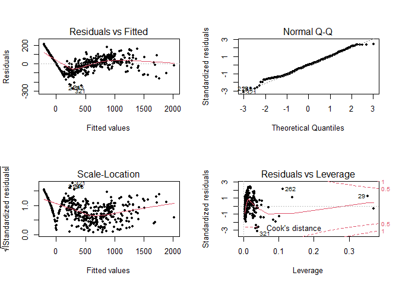
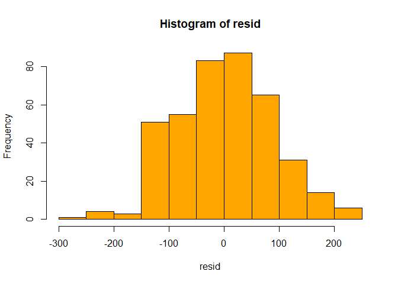

Credit Card Balance; Who is More in Debts
================
Nima Niarad
7/22/2021

<style> body {text-align: justify} </style>

<!-- Justify text. -->

## Part C - Test

``` r
library(readr)
Credit <- read_csv("C:/Nima/Rstudio/Git/Credit Card Balance; Who is More in Debts/Credit-Card-Balance--Who-is-More-in-Debts-/Credit.csv")
```

    ## 
    ## -- Column specification --------------------------------------------------------
    ## cols(
    ##   X1 = col_double(),
    ##   ID = col_double(),
    ##   Income = col_double(),
    ##   Limit = col_double(),
    ##   Rating = col_double(),
    ##   Cards = col_double(),
    ##   Age = col_double(),
    ##   Education = col_double(),
    ##   Gender = col_character(),
    ##   Student = col_character(),
    ##   Married = col_character(),
    ##   Ethnicity = col_character(),
    ##   Balance = col_double()
    ## )

First lets take a look at the models again, selecting the first and the
last models and comparing them:

**ANOVA**

``` r
lm.fit.1 = lm(Balance ~ Income + Limit, data = Credit)

Model.Final = lm(Balance ~ Income + Limit + I((Income*Limit)^3)+ I(Limit^3)+ Student, data = Credit)

anova(lm.fit.1, Model.Final)
```

    ## Analysis of Variance Table
    ## 
    ## Model 1: Balance ~ Income + Limit
    ## Model 2: Balance ~ Income + Limit + I((Income * Limit)^3) + I(Limit^3) + 
    ##     Student
    ##   Res.Df      RSS Df Sum of Sq      F    Pr(>F)    
    ## 1    397 10870832                                  
    ## 2    394  3097224  3   7773609 329.63 < 2.2e-16 ***
    ## ---
    ## Signif. codes:  0 '***' 0.001 '**' 0.01 '*' 0.05 '.' 0.1 ' ' 1

The alternative hypothesis indicates that the last model outperforms the
first one. It has a virtually zero p-value and it is a convincing proof
that it far surpasses lm.fit.1.

**The diagnostic plots of the least-squares regression fit**

``` r
par(mfrow = c(2,2))
plot(Model.Final, pch = 20)
```

<!-- -->

Residual vs Leverage Plot: Some outliers (321, 262, and 29), keep them
for now and dealing with them later! One document is not enough to say
the guy is the murderer!

Let’s see which observations have the largest leverage statistic:

``` r
which.max(hatvalues(Model.Final))
```

    ## 324 
    ## 324

Residual vs Fitted: Once again, the relationship is non-linear and it
proves it too.

Normal Q-Q: Indicating that quantiles truly come from Normal
distributions. Why? The points are almost forming a line.

**Confidence Intervals**

``` r
confint(Model.Final)
```

    ##                               2.5 %        97.5 %
    ## (Intercept)           -3.021490e+02 -2.359732e+02
    ## Income                -9.238356e+00 -8.341928e+00
    ## Limit                  2.047238e-01  2.258242e-01
    ## I((Income * Limit)^3) -8.413641e-17 -5.136121e-17
    ## I(Limit^3)             6.228531e-10  8.743556e-10
    ## StudentYes             4.089002e+02  4.671593e+02

For every one dollar increases in Limit, there is a 95% confident that
the corresponding Balance will change between 2.047238e-01 and
2.258242e-01.

If the model works, having an approximately normal distribution is a
must. So:

``` r
resid<- Model.Final$residuals
hist(resid, col = "orange")
```

<!-- -->

It is almost normally distributed which is a piece of good news. It is
the same as the Q-Q plot explained before.

Now it is time to test our model.

### The Validation Set Approach

Using this method to prove the model is the best one among the others.

``` r
set.seed(2)
Training.Samples = sample(400,200)

Model.Train = lm(Balance ~ Income + Limit + I((Income*Limit)^3)+ I(Limit^3)+ Student,
data = Credit, subset = Training.Samples)

MSE.Model.Final = mean((Credit$Balance - predict(Model.Train, Credit))[-Training.Samples]^2)
MSE.Model.Final
```

    ## [1] 8284.047

This is the estimated test MSE for the non-linear regression.

What about the other ones:

``` r
# lm.fit.1
set.seed(2)
Training.Samples = sample(400,200)
lm.fit.train.1 = lm(Balance ~ Income + Limit, data = Credit, subset = Training.Samples)
MES.1 = mean((Credit$Balance - predict(lm.fit.train.1, Credit))[-Training.Samples]^2)
MES.1
```

    ## [1] 24415.68

``` r
# lm.fit.2
lm.fit.train.2 = lm(Balance ~ Income + Limit + Age + Education, data = Credit,
subset = Training.Samples)
MES.2 = mean((Credit$Balance - predict(lm.fit.train.2, Credit))[-Training.Samples]^2)
MES.2
```

    ## [1] 24477.6

``` r
# lm.fit.3
lm.fit.train.3 = lm(Balance ~ Income*Limit, data = Credit, subset = Training.Samples)
MES.3 = mean((Credit$Balance - predict(lm.fit.train.3, Credit))[-Training.Samples]^2)
MES.3
```

    ## [1] 24059.72

``` r
# lm.fit.4
lm.fit.train.4 = lm(Balance ~ Income + Limit + Income*Limit + I(Limit^2),
data = Credit, subset = Training.Samples)
MES.4 = mean((Credit$Balance - predict(lm.fit.train.4, Credit))[-Training.Samples]^2)
MES.4
```

    ## [1] 20180.73

``` r
# lm.fit.5
lm.fit.train.5 = lm(Balance ~ Income + Limit + I((Income*Limit)^3)+ I(Limit^3),
data = Credit, subset = Training.Samples)
MES.5 = mean((Credit$Balance - predict(lm.fit.train.5, Credit))[-Training.Samples]^2)
MES.5
```

    ## [1] 21672.79

``` r
# lm.fit.6
lm.fit.train.6 = lm(Balance ~ Income + Limit + I((Income*Limit)^4)+ I(Limit^4) + Student,
data = Credit, subset = Training.Samples)
MES.6 = mean((Credit$Balance - predict(lm.fit.train.6, Credit))[-Training.Samples]^2)
MES.6
```

    ## [1] 9118.7

``` r
# lm.fit.7
lm.fit.train.7 = lm(Balance ~ Income + Limit + I((Income*Limit)^3)+ I(Limit^3) +
Student + Married,
data = Credit, subset = Training.Samples)
MES.7 = mean((Credit$Balance - predict(lm.fit.train.7, Credit))[-Training.Samples]^2)
MES.7
```

    ## [1] 8284.143

``` r
# lm.fit.8
lm.fit.train.8 = lm(Balance ~ log(Income) + Limit + I((Income*Limit)^3)+ I(Limit^3)+ Student,
data = Credit, subset = Training.Samples)
MES.8 = mean((Credit$Balance - predict(lm.fit.train.8, Credit))[-Training.Samples]^2)
MES.8
```

    ## [1] 16421.18

The final has the minimum MSE in comparison to the others &gt; Proving
the Model

However, this approach has some potential issues:

The result is a little different every time with a different set. Using
set.seed() function to have the same subset for all models but it is
just about testing a selecting subset, what about the other
observations!

### LOOCV and K-Fold Cross Validation

**LOOCV Method**: Taking an observation as a validation set and the
remaining ones are working as the training set. Repeating the process
for n times (Assume having n observations) and investigating the
results.

``` r
library(boot)
Model.F.glm = glm(Balance ~ Income + Limit + I((Income*Limit)^3)+ I(Limit^3)+ Student,
data = Credit)
error = cv.glm(Credit, Model.F.glm)
round(error$delta)
```

    ## [1] 8067 8067

``` r
cv.error = rep(0,5)
for (i in 1:5) {
Model.F.glm = glm(Balance ~ Income + Limit + poly(Income*Limit,i)+ poly(Limit,i)+ Student,
data = Credit)
cv.error[i] = cv.glm(Credit, Model.F.glm)$delta[1]
}
cv.error
```

    ## [1] 10159.356  6667.245  4673.443  4396.464  4394.264

MSE is going down as in third and fourth orders. However,the R-squared
for third-order is better than the fourth-order (From Part B). The
standard errors also were smaller for each variable in the third degree.
So, the third order is the best one.

### K-Fold Cross Validation

Using a large part of a data including a large number of points of the
data to get the better result is a must. Otherwise, the testing can go
wrong and leading to a variance issues.

What about training the testing process over and over again! How?
**K-Fold Cross Validation**

The computation process is shorter than LOOCV. However, choosing the
right number (K) is important. K is the number of folds that splits the
dataset. Less K leads to a more biased and higher value of K means a lot
of computation!

``` r
set.seed(27)
cv.error.10 = rep(0,10)
for (i in 1:10){
Model.KFold = glm(Balance ~ Income + Limit + poly(Income*Limit,i)+ poly(Limit,i)+ Student,
data = Credit)
cv.error.10[i] = cv.glm(Credit, Model.KFold, K = 10)$delta[1]
}
cv.error.10
```

    ##  [1]   10169.989    6647.659    4775.510    4354.404    4931.539    4942.473
    ##  [7]   14456.067  106085.106   17621.466 4498467.644

K is 10 here means the dataset is split in 10 equals parts. For example,
K = 1 contains 40 observations and this forms a group called the test
dataset or the holdout set, the remaining data (360 observations) would
be the training data. The process is fitting the model on the training
set and evaluate it on the test set.

The result shows the third and fourth degrees are the ones should be
considered, the fourth is off the table. It has a greater residual error
and standard error, also smaller R-squared.
